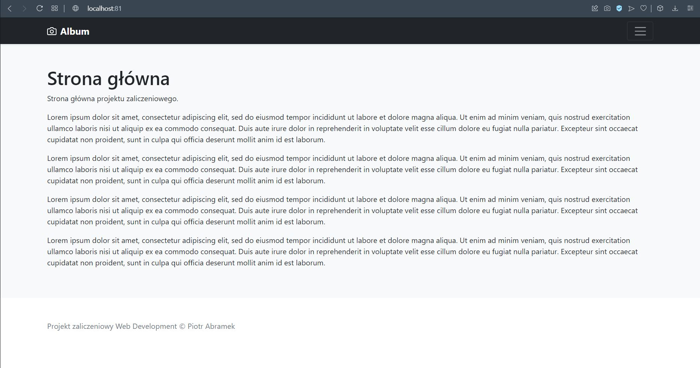
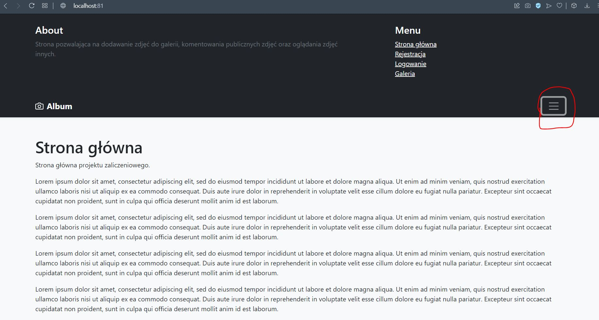
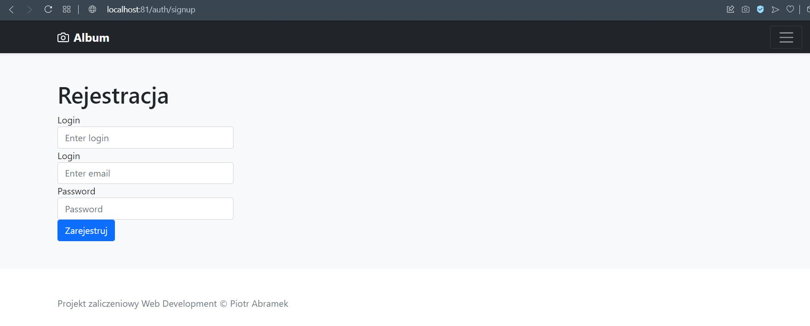
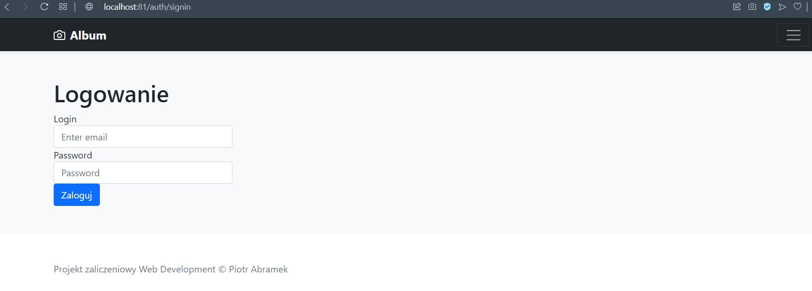
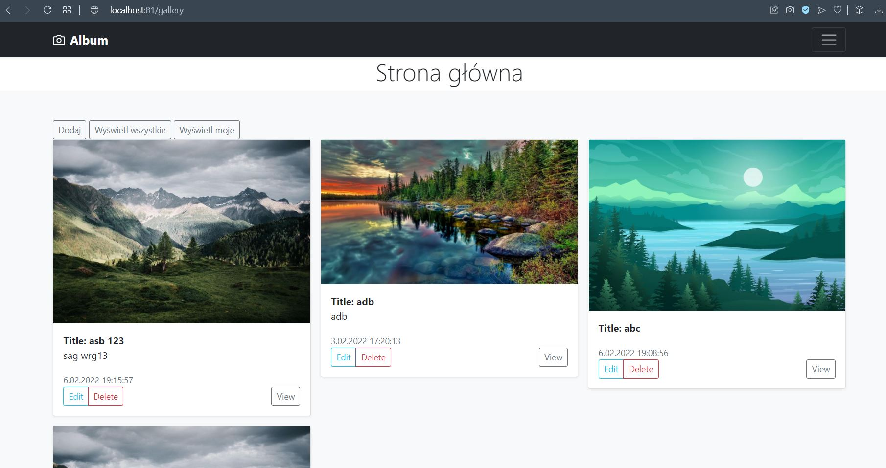
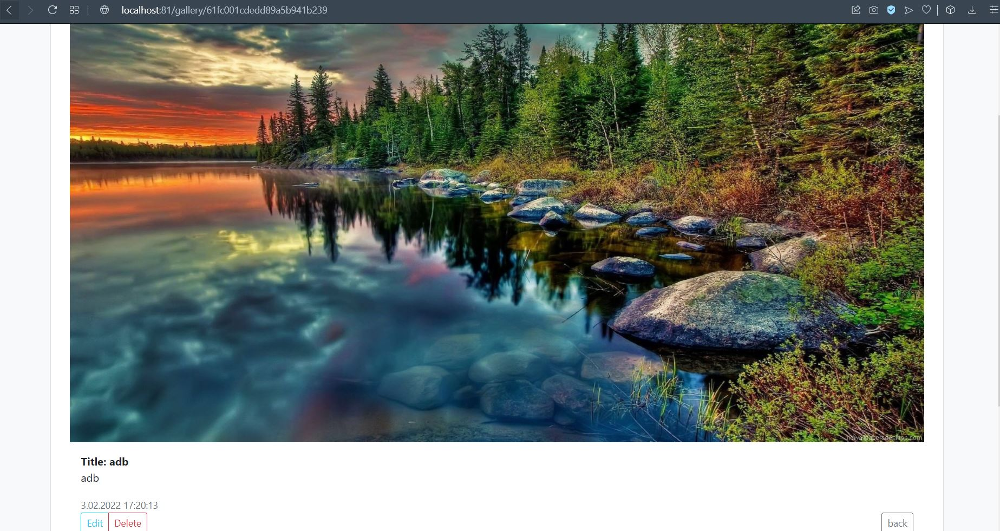
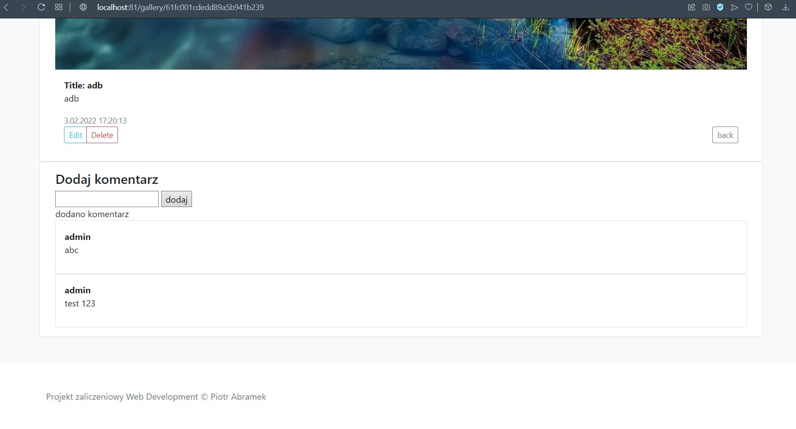
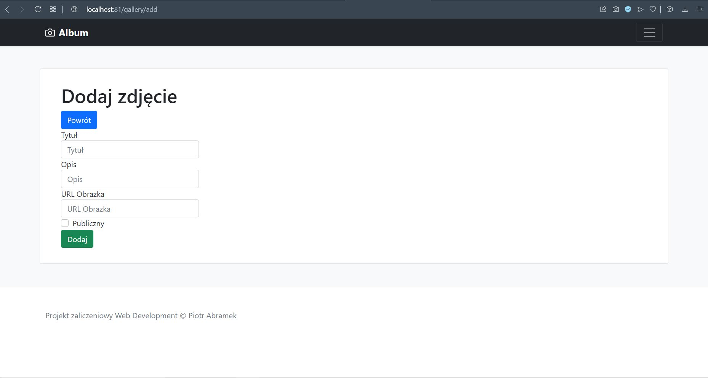
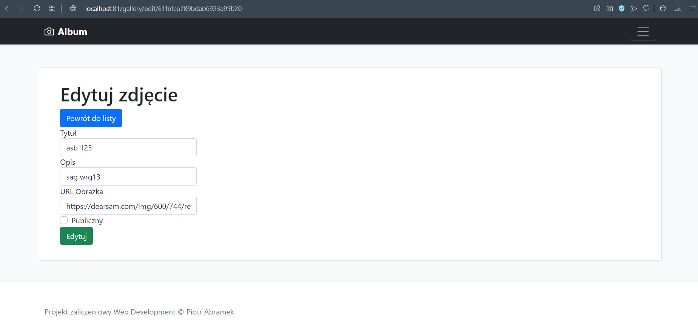

#Instrukcja aplikacji
###Uruchamianie:
<ol>
    <li>zainstaluj node.js oraz mongodb</li>
    <li>sklonuj repozytorium <i><b>git clone </b></i></li>
    <li>otwórz katalog sklonowanego repozytorium</li>
    <li>skonfiguruj połączenie z bazą mongo - plik MongoDB.js w katalogu app/db</li>
    <li>przejdź do katalogu app</li>
    <li>wykonaj polecenie w konsoli <i><b>npm i</b></i></li>
    <li>wykonaj polecenie <i><b>node app</b></i></li>
</ol>

###Po uruchomieniu projektu i przejściu pod adres http://localhost:81 powinna ukazać się poniższa strona internetowa:

###Strona główna

###Menu - należy nacisnąć zaznaczony czerwony przycisk

###Rejestracja

###Logowanie

###Galeria

###Widok podglądu zdjęcia

###Komentarze

###Dodawanie zdjęcia

###Edycja zdjęcia
